# Product Spec — پت فیچر (petfeature.ir)

Overview and index for petfeature.ir. Detailed requirements live in version-specific specs.

## Product summary

| Field | Value |
|--------|--------|
| **Product name** | پت فیچر (Pet Feature) |
| **Tagline** | دانشنامه یک مدیر محصول |
| **Owner** | Milad Mirzaei |
| **Domain** | [petfeature.ir](https://petfeature.ir) |
| **Language** | فارسی (RTL) |

**One-liner:** A personal PM encyclopedia built around four epics — Library, Blog, Tools, and Roadmap.

---

## Four epics

| Epic | Description | Status |
|------|-------------|--------|
| **Library** | Curated PM book library with full notes, quotes, media links, and downloads | **Shipped** (v1) |
| **Blog** | Personal PM essays with ratings, comments, social sharing, and view counts | **Shipped** (v2) |
| **Tools** | Curated PM template library — downloadable frameworks, guides, and artifacts for day-to-day work | **Shipped** (v3) |
| **Roadmap** | Structured learning path linking books and posts into an opinionated sequence | Backlog |

---

## Backlog epics (unscheduled)

| Epic | Description | Status |
|------|-------------|--------|
| **Telegram Channel** | Telegram channel join button in footer (v11.5); Newsletter Bot auto-post (v13) | Planned / Backlog |
| **Book Engagement** | Star ratings and comments on library books | **Shipped** (v4) |
| **Contact** | Contact page with form + admin inbox | **Shipped** (v5) |
| **Visitor Analytics** | Site-wide page-view tracking and admin dashboard (all page types) | **Shipped** (v6) |

See [Product Backlog](./product%20backlog.md) for feature detail.

---

## Version roadmap

```mermaid
flowchart LR
  v1["v1 ✓\nLibrary"] --> v2["v2 ✓\nBlog"]
  v2 --> v3["v3 ✓\nTools"]
  v3 --> v4["v4 ✓\nBook Engagement"]
  v4 --> v5["v5 ✓\nAbout + Contact"]
  v5 --> v6["v6 ✓\nAnalytics"]
  v6 --> v7["v7 ✓\nPost Replies"]
  v7 --> v8["v8 ✓\nContent Enhancements"]
  v8 --> v9["v9 ✓\nMedia Library"]
  v9 --> v10["v10 📋\nPost Related Books"]
  v10 --> v11.5["v11.5 📋\nTelegram Channel"]
  v11.5 --> v12["v12 📋\nUser Auth"]
  v12 --> v13["v13 📋\nNewsletter Bot"]
  v13 --> vN["...\nBacklog"]
```

| Version | Document | Epic | Scope | Status |
|---------|----------|------|-------|--------|
| **v1** | [Product Spec v1](./product-spec-v1.md) | Library | Book library, about page, admin CMS | **Shipped** |
| **v2** | [Product Spec v2](./product-spec-v2.md) | Blog | Posts, featured, view counts, star ratings, comments, social sharing | **Shipped** |
| **v3** | [Product Spec v3](./product-spec-v3.md) | Tools | Template library — downloadable PM artifacts with usage guides, cross-linked to books and posts | **Shipped** |
| **v4** | [Product Spec v4](./product-spec-v4.md) | Book Engagement | Star ratings and moderated comments on library books | **Shipped** |
| **v5** | [Product Spec v5](./product-spec-v5.md) | About Redesign + Contact | Redesigned About page (hero, experience, bootcamps) + new Contact page with admin inbox | **Shipped** |
| **v6** | [Product Spec v6](./product-spec-v6.md) | Visitor Analytics | PageView event log, bot filtering, admin dashboard with period filters + top content + referrers | **Shipped** |
| **v7** | [Product Spec v7](./product-spec-v7.md) | Post Comment Replies | Admin can reply to approved blog post comments; replies shown publicly beneath the original comment | **Shipped** |
| **v8** | [Product Spec v8](./product-spec-v8.md) | Content Enhancements | Book media link "website" type; post related books; tool downloadable links (file + external URL) | **Shipped** |
| **v9** | [Product Spec v9](./product-spec-v9.md) | Media Library + Book Link Types + Admin Filters | Admin media file manager; book link types article/book; admin books filter; cover preview fit; بلاگ→یادداشت rename | **Shipped** |
| **v10** | [Product Spec v10](./product-spec-v10.md) | Post Related Books | Related books widget in admin post form; related books section on public post detail page | **Planned** |
| ~~**v11**~~ | ~~[Product Spec v11](./product-spec-v11.md)~~ | ~~Newsletter (email)~~ | ~~Email subscription form + admin subscriber list~~ | **Cancelled** — superseded by v11.5 |
| **v11.5** | [Product Spec v11.5](./product-spec-v11.5.md) | Telegram Channel | Replace email form with Telegram channel join section pointing to @petfeature | **Planned** |
| **v12** | [Product Spec v12](./product-spec-v12.md) | User Registration + Auth | Email/password auth, session cookies, profile page, password reset, admin user list | **Backlog** |
| **v13** | [Product Spec v13](./product-spec-v13.md) | Newsletter Bot | Telegram Bot auto-posts to @petfeature on new content publish; admin compose panel | **Backlog** |
| **Backlog** | [Product Backlog](./product%20backlog.md) | — | Roadmap, Reading List (v14+) | Unscheduled |

---

## Problem & opportunity

**Readers:** PM learning is scattered; hard to find complete, curated book notes in one place — and no PM-focused tools in Persian.

**Admin:** v1–v9 all shipped. v10 (Post Related Books) is next. v11 email approach cancelled → replaced by v11.5 (Telegram channel join button). v13 (Newsletter Bot) wires Telegram auto-posting. v12 User Auth → Reading List (v14+) → Roadmap.

---

## Documentation index

| Doc | Purpose |
|-----|---------|
| [project-structure-and-deployment.md](./project-structure-and-deployment.md) | Project layout, stack, Hamravesh deploy, local dev |
| [product-spec-v1.md](./product-spec-v1.md) | PRD for Library epic (shipped) |
| [product-spec-v2.md](./product-spec-v2.md) | PRD for Blog epic (shipped) |
| [product-spec-v3.md](./product-spec-v3.md) | PRD for Tools epic (shipped) |
| [product-spec-v4.md](./product-spec-v4.md) | PRD for Book Engagement epic (shipped) |
| [product-spec-v5.md](./product-spec-v5.md) | PRD for About Redesign + Contact Page (shipped) |
| [product-spec-v6.md](./product-spec-v6.md) | PRD for Visitor Analytics (shipped) |
| [product-spec-v7.md](./product-spec-v7.md) | PRD for Post Comment Replies (shipped) |
| [product-spec-v8.md](./product-spec-v8.md) | PRD for Content Enhancements — book website links, post related books, tool downloadable links (shipped) |
| [product-spec-v9.md](./product-spec-v9.md) | PRD for Media Library + Book Link Types + Admin Filters (shipped) |
| [product-spec-v10.md](./product-spec-v10.md) | PRD for Post Related Books — admin post form widget + public post detail display (planned) |
| ~~[product-spec-v11.md](./product-spec-v11.md)~~ | ~~PRD for Newsletter (email) — cancelled; superseded by v11.5~~ |
| [product-spec-v11.5.md](./product-spec-v11.5.md) | PRD for Telegram Channel — replace email form with @petfeature join button (planned) |
| [product-spec-v12.md](./product-spec-v12.md) | PRD for User Registration + Auth — email/password auth, sessions, profile, password reset (backlog) |
| [product-spec-v13.md](./product-spec-v13.md) | PRD for Newsletter Bot — Telegram Bot auto-posts on publish + admin compose panel (backlog) |
| [product backlog.md](./product%20backlog.md) | Unscheduled ideas: Roadmap, newsletter |
| [use-case-diagram.md](./use-case-diagram.md) | UML use cases (v1–v8) |
| [use-case-diagram.puml](./use-case-diagram.puml) | PlantUML source |
| [admin-panel-design-spec.md](./admin-panel-design-spec.md) | Admin CMS design spec — all pages, fields, actions, constraints |

---

## Use case map (high level)

### v1 — Library (shipped)
- Browse Book Library → View Book Details
- Visit About Me
- Admin: Manage Library Content, Manage About Author Content

### v2 — Blog (shipped)
- Browse Blog → Read Post, Rate Post (stars), Comment on Post, Share, Copy Link
- Admin: Manage Blog Posts, Moderate Post Comments

### v3 — Tools (shipped)
- Browse Tools → Use a Tool (download file or open external link)
- Admin: Manage Tools

### v4 — Book Engagement (shipped)
- Rate a Book (stars) → View average rating
- Comment on a Book → Read approved comments
- Admin: Moderate Book Comments

### v5 — About Redesign + Contact (shipped)
- View About page with personal bio, work experience timeline, bootcamp listings
- Send Contact message via form
- Admin: Read/manage contact messages; Edit About content (experience, bootcamps)

### v6 — Visitor Analytics (shipped)
- Admin: View traffic dashboard (period filters, summary cards, top books/posts/tools, daily table, referrers)
- All dates in Jalali; bot-filtered; visitor dedup via cookie; tracks home, library, book, blog, post, tools, tool pages

### v7 — Post Comment Replies (shipped)
- Admin: Reply to approved blog post comments via richtext editor
- Reader: View admin reply beneath the original comment on the post detail page
- Same feature also applies to book comments

### v8 — Content Enhancements (shipped)
- Book detail: website-type media links rendered with distinct label alongside video/podcast
- Post detail: related books section shown below the post body, linking into the library
- Tool detail: external URL resources shown alongside file downloads; both count toward download count
- Admin: book form supports "website" link type; post form has related books picker; tool form supports link-type downloadable resources

### v9 — Media Library + Book Link Types + Admin Filters (shipped)
- Admin: Upload any file (PDF, video, document, image) to a central media library at `/admin/files/`
- Admin: Each uploaded file gets a permanent public URL with a copy-to-clipboard button
- Admin: Delete media files from the library (removes from disk + DB)
- Admin: Book form link type dropdown gains "مقاله" (article) and "کتاب" (book) options
- Book detail: article and book link types render with distinct labels
- Admin: Books list filter by status and category
- Admin: Book cover preview image fits to frame (object-fit: cover)
- Public nav: "بلاگ" label renamed to "یادداشت" across all public pages

### v10 — Post Related Books (planned)
- Admin: Post form (new + edit) gains a related books picker widget — select books from the library to associate with a post
- Public: Post detail page displays a "کتاب‌های مرتبط" section below the body, linking each associated book into the library

### ~~v11 — Newsletter email (cancelled)~~
Superseded by v11.5. Email subscriber approach abandoned in favour of Telegram channel.

### v11.5 — Telegram Channel (planned)
- Footer email subscription form removed and replaced with a Telegram channel join section
- Section shows: headline, one-line description, "عضویت در کانال" button → `https://t.me/petfeature`
- Channel handle `@petfeature` visible as supporting text
- No new models, routes, or migrations — pure template + CSS change
- All v11 email subscriber code (model, service, migration, admin page) must be reverted before committing

### v12 — User Registration + Auth (backlog)
- Visitor registers at `/register/` with name, email, password; logged in on success
- Visitor logs in at `/login/`; session cookie set; "مرا به خاطر بسپار" for 30-day persistence
- Logged-in user sees their name + logout link in site header
- Visitor resets password via email link (requires email provider — graceful fallback if unconfigured)
- Admin: View user list at `/admin/users/` with name, email, join date, status; can deactivate/reactivate

### v13 — Newsletter Bot (backlog)
- Telegram Bot auto-posts a formatted message to @petfeature when admin publishes a new Post, Book, or Tool
- Auto-post fires only on first publish — editing an already-published item does not re-send
- Telegram failure never blocks publishing (fire-and-forget; errors logged)
- Admin: "ارسال به کانال تلگرام" on-demand button on each published content item
- Admin: Custom compose panel at `/admin/telegram/compose/` for one-off channel messages
- Config: `TELEGRAM_BOT_TOKEN` + `TELEGRAM_CHANNEL_ID` env vars; all features silently disabled if token not set
- No DB changes; no library — single `httpx` POST to Bot API

### Backlog — Roadmap epic
- Browse Roadmap → View Path Steps (linked to books and posts)
- Admin: Manage Path Steps

See [use-case-diagram.md](./use-case-diagram.md) for full UML detail.

---

## Known gaps (not yet in any epic)

| Item | Notes |
|------|-------|
| Home page library preview | Static hardcoded cards — not loaded from DB |
| Telegram channel | Join button in footer — v11.5 (planned); Newsletter Bot auto-post — v13 (backlog) |

---

*July 2026 · v1–v9 all shipped. v10 next. v11 email cancelled → v11.5 Telegram channel. v13 Newsletter Bot (Telegram auto-post).*
