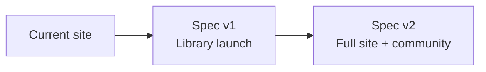

# Product Spec — پت فیچر (petfeature.ir)

Overview and index for the petfeature.ir remake. Detailed requirements live in version-specific specs.

## Product summary

| Field | Value |
|--------|--------|
| **Product name** | پت فیچر (Pet Feature) |
| **Tagline** | دانشنامه یک مدیر محصول |
| **Owner** | Milad Mirzaei |
| **Domain** | [petfeature.ir](https://petfeature.ir) |
| **Language** | فارسی (RTL) |

**One-liner:** A personal PM encyclopedia — ship the book library first in v1, then add path, blog, newsletter, contact, sharing, and community in v2.

---

## Version roadmap

| Version | Document | Scope |
|---------|----------|--------|
| **Current** | — | Live site baseline ([petfeature.ir](https://petfeature.ir)) |
| **v1** | **[Product Spec v1](./product-spec-v1.md)** | Library: browse books, visit about me; admin manages books and about-author content |
| **v2** | **[Product Spec v2](./product-spec-v2.md)** | Path, blog, newsletter, contact, share, register, auth, reactions, comments, moderation |

---

## Problem & opportunity

**Readers:** PM learning is scattered; hard to find complete, curated book notes in one place.

**Admin:** Need a solid library foundation first, then expand to path, blog, newsletter, and community.

**Approach:** Ship the **library** in **v1**, then add the full site and authenticated engagement in **v2**.

---

## Documentation index

| Doc | Purpose |
|-----|---------|
| [project-structure-and-deployment.md](./project-structure-and-deployment.md) | Project layout, Hamravesh deploy, local dev (updated with code changes) |
| [product-spec-v1.md](./product-spec-v1.md) | Full PRD for library launch |
| [product-spec-v2.md](./product-spec-v2.md) | Full PRD for full site + community release |
| [use-case-diagram.md](./use-case-diagram.md) | UML use cases (v1 + v2) |
| [use-case-diagram.puml](./use-case-diagram.puml) | PlantUML source |

---

## Use case map (high level)

### v1 — visitor

- Browse Book Library → View Book Details
- Visit About Me

### v1 — admin

- Manage Library Content
- Manage About Author Content

### v2 — adds for visitors

- Subscribe to Newsletter
- Contact
- Browse Learning Path → View Path Content
- Browse Blog → Read Blog Posts, Share to Social Networks

### v2 — adds for registered users

- Register + Authenticate
- Browse Book Library → Read Book Comments (post when logged in)
- Browse Blog → Make Reaction, Comment on Post

### v2 — adds for admin

- Manage Learning Path, Manage Blog Posts
- Receive Contact Messages, Send Newsletter
- Moderate Comments

See [use-case-diagram.md](./use-case-diagram.md) for full UML detail.

---

*June 2026*
