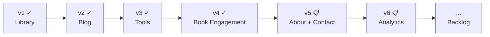

# Product Spec — پت فیچر (petfeature.ir)

Overview and index for petfeature.ir. Detailed requirements live in version-specific specs.

## Product summary

| Field | Value |
|--------|--------|
| **Product name** | پت فیچر (Pet Feature) |
| **Tagline** | دانشنامه یک مدیر محصول |
| **Owner** | Milad Mirzaei |
| **Domain** | [petfeature.ir](https://petfeature.ir) |
| **Language** | فارسی (RTL) |

**One-liner:** A personal PM encyclopedia built around four epics — Library, Blog, Tools, and Roadmap.

---

## Four epics

| Epic | Description | Status |
|------|-------------|--------|
| **Library** | Curated PM book library with full notes, quotes, media links, and downloads | **Shipped** (v1) |
| **Blog** | Personal PM essays with ratings, comments, social sharing, and view counts | **Shipped** (v2) |
| **Tools** | Curated PM template library — downloadable frameworks, guides, and artifacts for day-to-day work | **Shipped** (v3) |
| **Roadmap** | Structured learning path linking books and posts into an opinionated sequence | Backlog |

---

## Backlog epics (unscheduled)

| Epic | Description | Status |
|------|-------------|--------|
| **Newsletter + Contact** | Subscription form, contact page, admin subscriber/message views | Backlog |
| **Book Engagement** | Star ratings and comments on library books (book like deferred) | **Shipped** (v4) |
| **Visitor Analytics** | Site-wide page-view tracking and admin dashboard | Partial — post view counts only (shipped with Blog) |

See [Product Backlog](./product%20backlog.md) for feature detail.

---

## Version roadmap

| Version | Document | Epic | Scope | Status |
|---------|----------|------|-------|--------|
| **v1** | [Product Spec v1](./product-spec-v1.md) | Library | Book library, about page, admin CMS | **Shipped** |
| **v2** | [Product Spec v2](./product-spec-v2.md) | Blog | Posts, featured, view counts, star ratings, comments, social sharing | **Shipped** |
| **v3** | [Product Spec v3](./product-spec-v3.md) | Tools | Template library — downloadable PM artifacts with usage guides, cross-linked to books and posts | **Shipped** |
| **v4** | [Product Spec v4](./product-spec-v4.md) | Book Engagement | Star ratings and moderated comments on library books | **Shipped** |
| **v5** | [Product Spec v5](./product-spec-v5.md) | About Redesign + Contact | Redesigned About page (hero, experience, bootcamps) + new Contact page with admin inbox | **Planned** |
| **v6** | [Product Spec v6](./product-spec-v6.md) | Visitor Analytics | PageView event log, bot filtering, admin dashboard with period filters + top content + referrers | **Planned** |
| **Backlog** | [Product Backlog](./product%20backlog.md) | — | Roadmap, newsletter, book like | Unscheduled |

---

## Problem & opportunity

**Readers:** PM learning is scattered; hard to find complete, curated book notes in one place — and no PM-focused tools in Persian.

**Admin:** Library, blog, tools, book engagement, and the About redesign + Contact page (v5, planned) complete the core personal site. Next priorities from the backlog: Newsletter → Analytics → Roadmap.

---

## Documentation index

| Doc | Purpose |
|-----|---------|
| [project-structure-and-deployment.md](./project-structure-and-deployment.md) | Project layout, stack, Hamravesh deploy, local dev |
| [product-spec-v1.md](./product-spec-v1.md) | PRD for Library epic (shipped) |
| [product-spec-v2.md](./product-spec-v2.md) | PRD for Blog epic (shipped) |
| [product-spec-v3.md](./product-spec-v3.md) | PRD for Tools epic (shipped) |
| [product-spec-v4.md](./product-spec-v4.md) | PRD for Book Engagement epic (shipped) |
| [product-spec-v5.md](./product-spec-v5.md) | PRD for About Redesign + Contact Page (planned) |
| [product-spec-v6.md](./product-spec-v6.md) | PRD for Visitor Analytics (planned) |
| [product backlog.md](./product%20backlog.md) | Unscheduled ideas: Roadmap, newsletter, book like, analytics |
| [use-case-diagram.md](./use-case-diagram.md) | UML use cases (v1 + v2 + v3 + v4) |
| [use-case-diagram.puml](./use-case-diagram.puml) | PlantUML source |
| [admin-panel-design-spec.md](./admin-panel-design-spec.md) | Admin CMS design spec — all pages, fields, actions, constraints (redesign handoff) |

---

## Use case map (high level)

### v1 — Library (shipped)
- Browse Book Library → View Book Details
- Visit About Me
- Admin: Manage Library Content, Manage About Author Content

### v2 — Blog (shipped)
- Browse Blog → Read Post, Rate Post (stars), Comment on Post, Share, Copy Link
- Admin: Manage Blog Posts, Moderate Post Comments

### v3 — Tools (shipped)
- Browse Tools → Use a Tool
- Admin: Manage Tools

### v4 — Book Engagement (shipped)
- Rate a Book (stars) → View average rating
- Comment on a Book → Read approved comments
- Admin: Moderate Book Comments

### v5 — About Redesign + Contact (planned)
- View About page with personal bio, work timeline, bootcamp listings
- Send Contact message via form
- Admin: Read/manage contact messages; Edit About content (experience, bootcamps)

### v6 — Visitor Analytics (planned)
- Admin: View traffic dashboard (period filters, summary cards, top books/posts/tools, daily table, referrers)
- All dates in Jalali; bot-filtered; visitor dedup via existing cookie

### Backlog — Roadmap epic
- Browse Roadmap → View Path Steps (linked to books and posts)
- Admin: Manage Path Steps

See [use-case-diagram.md](./use-case-diagram.md) for full UML detail.

---

## Known gaps (not yet in any epic)

| Item | Notes |
|------|-------|
| Home page library preview | Static hardcoded cards — not loaded from DB |
| Book page analytics | v1 NFR mentions traffic on book pages; only post view counts exist today |
| Site-wide analytics dashboard | Backlog epic — partial overlap with post view counts |

---

*July 2026 · Updated to reflect v5 About + Contact planned; backlog re-prioritized*
