# Product Spec — پت فیچر (petfeature.ir)

Overview and index for petfeature.ir. Detailed requirements live in version-specific specs.

## Product summary

| Field | Value |
|--------|--------|
| **Product name** | پت فیچر (Pet Feature) |
| **Tagline** | دانشنامه یک مدیر محصول |
| **Owner** | Milad Mirzaei |
| **Domain** | [petfeature.ir](https://petfeature.ir) |
| **Language** | فارسی (RTL) |

**One-liner:** A personal PM encyclopedia built around four epics — Library, Blog, Tools, and Roadmap.

---

## Four epics

| Epic | Description | Status |
|------|-------------|--------|
| **Library** | Curated PM book library with full notes, quotes, media links, and downloads | **Shipped** (v1) |
| **Blog** | Personal PM essays with ratings, comments, social sharing, and view counts | **Shipped** (v2) |
| **Tools** | Curated PM template library — downloadable frameworks, guides, and artifacts for day-to-day work | **Shipped** (v3) |
| **Roadmap** | Structured learning path linking books and posts into an opinionated sequence | Backlog |

---

## Backlog epics (unscheduled)

| Epic | Description | Status |
|------|-------------|--------|
| **Telegram Channel** | Telegram channel join button in footer (v11.5 — shipped); Newsletter Bot auto-post + AI draft (v13 — backlog) | Shipped / Backlog |
| **Book Engagement** | Star ratings and comments on library books | **Shipped** (v4) |
| **Contact** | Contact page with form + admin inbox | **Shipped** (v5) |
| **Visitor Analytics** | Site-wide page-view tracking and admin dashboard (all page types) | **Shipped** (v6) |

See [Product Backlog](./product%20backlog.md) for feature detail.

---

## Version roadmap

```mermaid
flowchart LR
  v1["v1 ✓\nLibrary"] --> v2["v2 ✓\nBlog"]
  v2 --> v3["v3 ✓\nTools"]
  v3 --> v4["v4 ✓\nBook Engagement"]
  v4 --> v5["v5 ✓\nAbout + Contact"]
  v5 --> v6["v6 ✓\nAnalytics"]
  v6 --> v7["v7 ✓\nPost Replies"]
  v7 --> v8["v8 ✓\nContent Enhancements"]
  v8 --> v9["v9 ✓\nMedia Library"]
  v9 --> v10["v10 📋\nPost Related Books"]
  v10 --> v11["v11 ✓\nNewsletter"]
  v11 --> v11.5["v11.5 ✓\nTelegram Channel"]
  v11.5 --> v12["v12 📋\nUser Auth"]
  v12 --> v13.5["v13.5 📋\nTG Popup"]
  v13.5 --> v14["v14 📋\nUser Dashboard"]
  v14 --> vN["...\nBacklog"]
```

| Version | Document | Epic | Scope | Status |
|---------|----------|------|-------|--------|
| **v1** | [Product Spec v1](./product-spec-v1.md) | Library | Book library, about page, admin CMS | **Shipped** |
| **v2** | [Product Spec v2](./product-spec-v2.md) | Blog | Posts, featured, view counts, star ratings, comments, social sharing | **Shipped** |
| **v3** | [Product Spec v3](./product-spec-v3.md) | Tools | Template library — downloadable PM artifacts with usage guides, cross-linked to books and posts | **Shipped** |
| **v4** | [Product Spec v4](./product-spec-v4.md) | Book Engagement | Star ratings and moderated comments on library books | **Shipped** |
| **v5** | [Product Spec v5](./product-spec-v5.md) | About Redesign + Contact | Redesigned About page (hero, experience, bootcamps) + new Contact page with admin inbox | **Shipped** |
| **v6** | [Product Spec v6](./product-spec-v6.md) | Visitor Analytics | PageView event log, bot filtering, admin dashboard with period filters + top content + referrers | **Shipped** |
| **v7** | [Product Spec v7](./product-spec-v7.md) | Post Comment Replies | Admin can reply to approved blog post comments; replies shown publicly beneath the original comment | **Shipped** |
| **v8** | [Product Spec v8](./product-spec-v8.md) | Content Enhancements | Book media link "website" type; post related books; tool downloadable links (file + external URL) | **Shipped** |
| **v9** | [Product Spec v9](./product-spec-v9.md) | Media Library + Book Link Types + Admin Filters | Admin media file manager; book link types article/book; admin books filter; cover preview fit; بلاگ→یادداشت rename | **Shipped** |
| **v10** | [Product Spec v10](./product-spec-v10.md) | Post Related Books | Related books widget in admin post form; related books section on public post detail page | **Planned** |
| **v11** | [Product Spec v11](./product-spec-v11.md) | Newsletter | Email subscriber form + admin subscriber list + `Subscriber` model | **Shipped** |
| **v11.5** | [Product Spec v11.5](./product-spec-v11.5.md) | Telegram Channel | Replace public footer email form with @petfeature Telegram join strip; subscriber admin remains live | **Shipped** |
| **v12** | [Product Spec v12](./product-spec-v12.md) | User Auth via Google Login | Google OAuth only (no email/password, no SMTP); auto-registration on first login; profile page; admin user list | **Backlog** |
| **v13** | [Product Spec v13](./product-spec-v13.md) | Newsletter AI Draft Agent | Campaign log + AI draft agent (Claude Haiku generates Persian digest from new content diff); admin compose panel; no auto-posting | **Shipped** |
| **v13.5** | [Product Spec v13.5](./product-spec-v13.5.md) | Telegram Popup | 30-second popup inviting visitors to join @petfeature; dismissed once via localStorage; no DB | **Backlog** |
| **v14** | [Product Spec v14](./product-spec-v14.md) | User Dashboard | Newsletter subscribe/unsubscribe + My Comments with admin replies; expands v12 profile page | **Backlog** |
| **Backlog** | [Product Backlog](./product%20backlog.md) | — | Reading List (v15+), Roadmap | Unscheduled |

---

## Problem & opportunity

**Readers:** PM learning is scattered; hard to find complete, curated book notes in one place — and no PM-focused tools in Persian.

**Admin:** v1–v9, v11 (Newsletter), v11.5 (Telegram Channel) all shipped. v10 (Post Related Books) is next. After that: v12 User Auth → v13 Newsletter Bot (Telegram auto-post + AI draft agent) → Reading List (v14+) → Roadmap.

---

## Documentation index

| Doc | Purpose |
|-----|---------|
| [project-structure-and-deployment.md](./project-structure-and-deployment.md) | Project layout, stack, Hamravesh deploy, local dev |
| [product-spec-v1.md](./product-spec-v1.md) | PRD for Library epic (shipped) |
| [product-spec-v2.md](./product-spec-v2.md) | PRD for Blog epic (shipped) |
| [product-spec-v3.md](./product-spec-v3.md) | PRD for Tools epic (shipped) |
| [product-spec-v4.md](./product-spec-v4.md) | PRD for Book Engagement epic (shipped) |
| [product-spec-v5.md](./product-spec-v5.md) | PRD for About Redesign + Contact Page (shipped) |
| [product-spec-v6.md](./product-spec-v6.md) | PRD for Visitor Analytics (shipped) |
| [product-spec-v7.md](./product-spec-v7.md) | PRD for Post Comment Replies (shipped) |
| [product-spec-v8.md](./product-spec-v8.md) | PRD for Content Enhancements — book website links, post related books, tool downloadable links (shipped) |
| [product-spec-v9.md](./product-spec-v9.md) | PRD for Media Library + Book Link Types + Admin Filters (shipped) |
| [product-spec-v10.md](./product-spec-v10.md) | PRD for Post Related Books — admin post form widget + public post detail display (planned) |
| [product-spec-v11.md](./product-spec-v11.md) | PRD for Newsletter — email subscriber form + admin list + Subscriber model (shipped) |
| [product-spec-v11.5.md](./product-spec-v11.5.md) | PRD for Telegram Channel — replace footer email form with @petfeature join strip (shipped) |
| [product-spec-v12.md](./product-spec-v12.md) | PRD for User Auth — Google Login only; no email/password; auto-registration; profile page; admin user list (backlog) |
| [product-spec-v13.md](./product-spec-v13.md) | PRD for Newsletter AI Draft Agent — campaign log + AI draft via Claude Haiku + admin compose panel; no auto-posting (shipped) |
| [product-spec-v13.5.md](./product-spec-v13.5.md) | PRD for Telegram Popup — 30s delay popup inviting visitors to join @petfeature; localStorage dismiss; no DB (backlog) |
| [product-spec-v14.md](./product-spec-v14.md) | PRD for User Dashboard — newsletter subscribe/unsubscribe + My Comments with admin replies (backlog) |
| [product backlog.md](./product%20backlog.md) | Unscheduled ideas: Roadmap, newsletter |
| [use-case-diagram.md](./use-case-diagram.md) | UML use cases (v1–v8) |
| [use-case-diagram.puml](./use-case-diagram.puml) | PlantUML source |
| [admin-panel-design-spec.md](./admin-panel-design-spec.md) | Admin CMS design spec — all pages, fields, actions, constraints |

---

## Use case map (high level)

### v1 — Library (shipped)
- Browse Book Library → View Book Details
- Visit About Me
- Admin: Manage Library Content, Manage About Author Content

### v2 — Blog (shipped)
- Browse Blog → Read Post, Rate Post (stars), Comment on Post, Share, Copy Link
- Admin: Manage Blog Posts, Moderate Post Comments

### v3 — Tools (shipped)
- Browse Tools → Use a Tool (download file or open external link)
- Admin: Manage Tools

### v4 — Book Engagement (shipped)
- Rate a Book (stars) → View average rating
- Comment on a Book → Read approved comments
- Admin: Moderate Book Comments

### v5 — About Redesign + Contact (shipped)
- View About page with personal bio, work experience timeline, bootcamp listings
- Send Contact message via form
- Admin: Read/manage contact messages; Edit About content (experience, bootcamps)

### v6 — Visitor Analytics (shipped)
- Admin: View traffic dashboard (period filters, summary cards, top books/posts/tools, daily table, referrers)
- All dates in Jalali; bot-filtered; visitor dedup via cookie; tracks home, library, book, blog, post, tools, tool pages

### v7 — Post Comment Replies (shipped)
- Admin: Reply to approved blog post comments via richtext editor
- Reader: View admin reply beneath the original comment on the post detail page
- Same feature also applies to book comments

### v8 — Content Enhancements (shipped)
- Book detail: website-type media links rendered with distinct label alongside video/podcast
- Post detail: related books section shown below the post body, linking into the library
- Tool detail: external URL resources shown alongside file downloads; both count toward download count
- Admin: book form supports "website" link type; post form has related books picker; tool form supports link-type downloadable resources

### v9 — Media Library + Book Link Types + Admin Filters (shipped)
- Admin: Upload any file (PDF, video, document, image) to a central media library at `/admin/files/`
- Admin: Each uploaded file gets a permanent public URL with a copy-to-clipboard button
- Admin: Delete media files from the library (removes from disk + DB)
- Admin: Book form link type dropdown gains "مقاله" (article) and "کتاب" (book) options
- Book detail: article and book link types render with distinct labels
- Admin: Books list filter by status and category
- Admin: Book cover preview image fits to frame (object-fit: cover)
- Public nav: "بلاگ" label renamed to "یادداشت" across all public pages

### v10 — Post Related Books (planned)
- Admin: Post form (new + edit) gains a related books picker widget — select books from the library to associate with a post
- Public: Post detail page displays a "کتاب‌های مرتبط" section below the body, linking each associated book into the library

### v11 — Newsletter (shipped)
- Visitor subscribes via footer form (name + email); success message shown; duplicate emails silently accepted; honeypot spam protection
- Admin: View subscriber list at `/admin/subscribers/` with name, email, Jalali date, and count; paginated
- `Subscriber` model + Alembic migration shipped; email collection only — no sending in v11

### v11.5 — Telegram Channel (shipped)
- Footer email form replaced with Telegram channel join strip pointing to `https://t.me/petfeature`
- Strip shows: Persian headline, one-line description, "عضویت در کانال" button, @petfeature handle
- v11 `Subscriber` admin page and DB table remain live — email collection kept as a secondary channel
- Logo replaced with petfeature brand images; Vazirmatn Bold font added (shipped in same batch)

### v12 — User Auth via Google Login (backlog)
- Visitor clicks "ورود با گوگل" → Google OAuth flow → auto-registered on first login; no email/password form
- No SMTP or password reset needed — Google handles identity entirely
- Session cookie set (30 days, always persistent); user's name shown in header with logout link
- Profile page: name, email, Jalali join date — minimal in v12 (Option C); personalised features in v14+
- Admin: user list at `/admin/users/` with name, email, Jalali join date, status; deactivate/reactivate
- Library: `authlib`; new env vars: `GOOGLE_CLIENT_ID`, `GOOGLE_CLIENT_SECRET`, `GOOGLE_REDIRECT_URI`

### v13 — Newsletter AI Draft Agent (shipped)
- Admin: Campaign log at `/admin/newsletters/` — all sent newsletters and drafts in reverse chronological order
- Admin: "خبرنامه جدید" → choose AI draft or manual compose
- AI Draft: one click queries all content published since last sent campaign → passes titles + excerpts to Claude Haiku → returns Persian Telegram-formatted newsletter draft
- If no new content since last send → shows message; no draft generated
- Admin edits draft in textarea, saves as draft or sends directly to @petfeature channel
- On send: campaign status → `sent`, `sent_at` recorded, message posted to Telegram via Bot API
- Config: `TELEGRAM_BOT_TOKEN`, `TELEGRAM_CHANNEL_ID`, `ANTHROPIC_API_KEY` — features gracefully disabled if tokens missing
- Model: `NewsletterCampaign` (body, status: draft/sent, sent_at)
- No auto-posting on publish; no per-item send buttons — admin sends deliberately

### v13.5 — Telegram Subscription Popup (backlog)
- After 30 seconds on any public page, a modal popup appears inviting visitor to join @petfeature
- Popup: Persian headline + body copy + "عضویت در کانال @petfeature" CTA → `https://t.me/petfeature`
- Dismissed via ×, "بعداً" link, overlay click, or Escape key
- On any dismiss (including CTA click): `localStorage.pf_tg_popup_seen = '1'` — never shows again
- No DB, no route, no migration — pure JS + CSS in `base.html`
- Does not appear on `/admin/` pages

### v14 — User Dashboard (backlog)
- Expands the v12 profile page into a dashboard with two sections
- **Newsletter section:** shows email subscription status (from Subscriber model); subscribe/unsubscribe without re-entering email (uses Google account email); Telegram channel join button
- **My Comments section:** all PostComments + BookComments posted by the logged-in user; shows content title (linked), comment text, Jalali date, status badge (در انتظار / تأیید شده / رد شده), and admin reply if one exists
- Requires: `user_id` nullable FK added to `PostComment` + `BookComment` (new migration); new comments from logged-in users get `user_id` set automatically

### Backlog — Roadmap epic
- Browse Roadmap → View Path Steps (linked to books and posts)
- Admin: Manage Path Steps

See [use-case-diagram.md](./use-case-diagram.md) for full UML detail.

---

## Known gaps (not yet in any epic)

| Item | Notes |
|------|-------|
| Home page library preview | Static hardcoded cards — not loaded from DB |
| Telegram channel | Join button in footer — v11.5 (planned); Newsletter Bot auto-post — v13 (backlog) |

---

*July 2026 · v1–v9, v11 (Newsletter), v11.5 (Telegram Channel) all shipped. v10 (Post Related Books) is next.*
