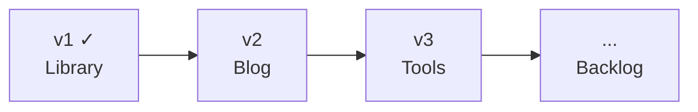

# Product Spec — پت فیچر (petfeature.ir)

Overview and index for petfeature.ir. Detailed requirements live in version-specific specs.

## Product summary

| Field | Value |
|--------|--------|
| **Product name** | پت فیچر (Pet Feature) |
| **Tagline** | دانشنامه یک مدیر محصول |
| **Owner** | Milad Mirzaei |
| **Domain** | [petfeature.ir](https://petfeature.ir) |
| **Language** | فارسی (RTL) |

**One-liner:** A personal PM encyclopedia built around four epics — Library, Blog, Tools, and Roadmap.

---

## Four epics

| Epic | Description | Status |
|------|-------------|--------|
| **Library** | Curated PM book library with full notes, quotes, media links, and downloads | Shipped (v1) |
| **Blog** | Personal PM essays with ratings, comments, social sharing, and view counts | Planned (v2) |
| **Tools** | Curated PM template library — downloadable frameworks, guides, and artifacts for day-to-day work | Planned (v3) |
| **Roadmap** | Structured learning path linking books and posts into an opinionated sequence | Backlog |

---

## Version roadmap

| Version | Document | Epic | Scope | Status |
|---------|----------|------|-------|--------|
| **v1** | [Product Spec v1](./product-spec-v1.md) | Library | Book library, about page, admin CMS | **Shipped** |
| **v2** | [Product Spec v2](./product-spec-v2.md) | Blog | Posts, featured, tag filter, view counts, star ratings, comments, social sharing | Planned |
| **v3** | [Product Spec v3](./product-spec-v3.md) | Tools | Template library — downloadable PM artifacts with usage guides, cross-linked to books and posts | Planning |
| **Backlog** | [Idea Backlog](./idea-backlog.md) | All | Roadmap, newsletter, contact, book engagement, analytics | Unscheduled |

---

## Problem & opportunity

**Readers:** PM learning is scattered; hard to find complete, curated book notes in one place — and no PM-focused tools in Persian.

**Admin:** Needs a solid library and blog first, then practical tools, then a structured learning path.

---

## Documentation index

| Doc | Purpose |
|-----|---------|
| [project-structure-and-deployment.md](./project-structure-and-deployment.md) | Project layout, stack, Hamravesh deploy, local dev |
| [product-spec-v1.md](./product-spec-v1.md) | PRD for Library epic (shipped) |
| [product-spec-v2.md](./product-spec-v2.md) | PRD for Blog epic |
| [product-spec-v3.md](./product-spec-v3.md) | PRD for Tools epic |
| [idea-backlog.md](./idea-backlog.md) | Unscheduled ideas: Roadmap, newsletter, contact, book engagement, analytics |
| [use-case-diagram.md](./use-case-diagram.md) | UML use cases (v1 + v2 + v3) |
| [use-case-diagram.puml](./use-case-diagram.puml) | PlantUML source |

---

## Use case map (high level)

### v1 — Library (shipped)
- Browse Book Library → View Book Details
- Visit About Me
- Admin: Manage Library Content, Manage About Author Content

### v2 — Blog
- Browse Blog → Read Post, Rate Post (stars), Comment on Post, Share, Copy Link
- Admin: Manage Blog Posts, Moderate Post Comments

### v3 — Tools
- Browse Tools → Use a Tool
- Admin: Manage Tools

### Backlog — Roadmap epic
- Browse Roadmap → View Path Steps (linked to books and posts)
- Admin: Manage Path Steps

See [use-case-diagram.md](./use-case-diagram.md) for full UML detail.

---

*July 2026*
