# Product Spec — پت فیچر (petfeature.ir)

Overview and index for petfeature.ir. Detailed requirements live in version-specific specs.

## Product summary

| Field | Value |
|--------|--------|
| **Product name** | پت فیچر (Pet Feature) |
| **Tagline** | دانشنامه یک مدیر محصول |
| **Owner** | Milad Mirzaei |
| **Domain** | [petfeature.ir](https://petfeature.ir) |
| **Language** | فارسی (RTL) |

**One-liner:** A personal PM encyclopedia built around four epics — Library, Blog, Tools, and Roadmap.

---

## Four epics

| Epic | Description | Status |
|------|-------------|--------|
| **Library** | Curated PM book library with full notes, quotes, media links, and downloads | **Shipped** (v1) |
| **Blog** | Personal PM essays with ratings, comments, social sharing, and view counts | **Shipped** (v2) |
| **Tools** | Curated PM template library — downloadable frameworks, guides, and artifacts for day-to-day work | **Shipped** (v3) |
| **Roadmap** | Structured learning path linking books and posts into an opinionated sequence | Backlog |

---

## Backlog epics (unscheduled)

| Epic | Description | Status |
|------|-------------|--------|
| **Telegram Channel** | Telegram channel join strip in footer (v11.5) + AI-drafted Telegram digest (v13) | **Shipped** |
| **Book Engagement** | Star ratings and comments on library books | **Shipped** (v4) |
| **Contact** | Contact page with form + admin inbox | **Shipped** (v5) |
| **Visitor Analytics** | Site-wide page-view tracking and admin dashboard (all page types) | **Shipped** (v6) |

See [Product Backlog](./product%20backlog.md) for feature detail.

---

## Version roadmap

```mermaid
flowchart LR
  v1["v1 ✓\nLibrary"] --> v2["v2 ✓\nBlog"]
  v2 --> v3["v3 ✓\nTools"]
  v3 --> v4["v4 ✓\nBook Engagement"]
  v4 --> v5["v5 ✓\nAbout + Contact"]
  v5 --> v6["v6 ✓\nAnalytics"]
  v6 --> v7["v7 ✓\nPost Replies"]
  v7 --> v8["v8 ✓\nContent Enhancements"]
  v8 --> v9["v9 ✓\nMedia Library"]
  v9 --> v10["v10 📋\nPost Related Books"]
  v10 --> v11.5["v11.5 ✓\nTelegram Channel"]
  v11.5 --> v12["v12 📋\nUser Auth"]
  v12 --> v13.5["v13.5 📋\nTG Popup"]
  v13.5 --> v14["v14 📋\nUser Dashboard"]
  v14 --> vN["...\nBacklog"]
```

| Version | Document | Epic | Scope | Status |
|---------|----------|------|-------|--------|
| **v1** | [Product Spec v1](./spec-v1-library.md) | Library | Book library, about page, admin CMS | **Shipped** |
| **v2** | [Product Spec v2](./spec-v2-blog.md) | Blog | Posts, featured, view counts, star ratings, comments, social sharing | **Shipped** |
| **v3** | [Product Spec v3](./spec-v3-tools.md) | Tools | Template library — downloadable PM artifacts with usage guides, cross-linked to books and posts | **Shipped** |
| **v4** | [Product Spec v4](./spec-v4-book-engagement.md) | Book Engagement | Star ratings and moderated comments on library books | **Shipped** |
| **v5** | [Product Spec v5](./spec-v5-about-contact.md) | About Redesign + Contact | Redesigned About page (hero, experience, bootcamps) + new Contact page with admin inbox | **Shipped** |
| **v6** | [Product Spec v6](./spec-v6-analytics.md) | Visitor Analytics | PageView event log, bot filtering, admin dashboard with period filters + top content + referrers | **Shipped** |
| **v6.1** | [Product Spec v6.1](./spec-v6.1-roadmap-analytics.md) | Roadmap Analytics Extension | Classify `/path/*` routes in middleware; roadmap section in admin analytics dashboard | **Planned** |
| **v7** | [Product Spec v7](./spec-v7-comment-replies.md) | Post Comment Replies | Admin can reply to approved blog post comments; replies shown publicly beneath the original comment | **Shipped** |
| **v8** | [Product Spec v8](./spec-v8-content-enhancements.md) | Content Enhancements | Book media link "website" type; post related books; tool downloadable links (file + external URL) | **Shipped** |
| **v9** | [Product Spec v9](./spec-v9-media-library.md) | Media Library + Book Link Types + Admin Filters | Admin media file manager; book link types article/book; admin books filter; cover preview fit; بلاگ→یادداشت rename | **Shipped** |
| **v10** | [Product Spec v10](./spec-v10-post-related-books.md) | Post Related Books | Related books widget in admin post form; related books section on public post detail page | **Planned** |
| **v11.5** | [Product Spec v11.5](./spec-v11.5-telegram-channel.md) | Telegram Channel | @petfeature Telegram join strip in the footer — the single subscription channel | **Shipped** |
| **v12** | [Product Spec v12](./spec-v12-user-auth.md) | User Auth via Google Login | Google OAuth only (no email/password, no SMTP); auto-registration on first login; profile page; admin user list | **Backlog** |
| **v13** | [Product Spec v13](./spec-v13-newsletter-ai-agent.md) | Telegram Digest AI Agent | Campaign log + AI draft agent (Claude Haiku generates Persian digest from new content diff); admin compose panel; sends to Telegram; no auto-posting | **Shipped** |
| **v13.5** | [Product Spec v13.5](./spec-v13.5-telegram-popup.md) | Telegram Popup | 30-second popup inviting visitors to join @petfeature; dismissed once via localStorage; no DB | **Backlog** |
| **v14** | [Product Spec v14](./spec-v14-user-dashboard.md) | User Dashboard | My Comments with admin replies + Telegram channel link; expands v12 profile page | **Backlog** |
| **v15** | [Product Spec v15](./spec-v15-bookshelf.md) | Bookshelf (قفسه کتاب) | Personal bookshelf with reading statuses; social proof save count; admin save counts; requires v12 | **Backlog** |

---

## Problem & opportunity

**Readers:** PM learning is scattered; hard to find complete, curated book notes in one place — and no PM-focused tools in Persian.

**Admin:** v1–v9, v11.5 (Telegram Channel) and v13 (Telegram Digest AI Agent) all shipped. v10 (Post Related Books) is next. After that: v12 User Auth → v14 User Dashboard → v15 Bookshelf → v16 Learning Roadmap.

---

## Documentation index

| Doc | Purpose |
|-----|---------|
| [project-structure-and-deployment.md](./project-structure-and-deployment.md) | Project layout, stack, Hamravesh deploy, local dev |
| [spec-v1-library.md](./spec-v1-library.md) | PRD for Library epic (shipped) |
| [spec-v2-blog.md](./spec-v2-blog.md) | PRD for Blog epic (shipped) |
| [spec-v3-tools.md](./spec-v3-tools.md) | PRD for Tools epic (shipped) |
| [spec-v4-book-engagement.md](./spec-v4-book-engagement.md) | PRD for Book Engagement epic (shipped) |
| [spec-v5-about-contact.md](./spec-v5-about-contact.md) | PRD for About Redesign + Contact Page (shipped) |
| [spec-v6-analytics.md](./spec-v6-analytics.md) | PRD for Visitor Analytics (shipped) |
| [spec-v6.1-roadmap-analytics.md](./spec-v6.1-roadmap-analytics.md) | PRD for Roadmap Analytics Extension — classify `/path/*` routes + roadmap dashboard section (planned) |
| [spec-v7-comment-replies.md](./spec-v7-comment-replies.md) | PRD for Post Comment Replies (shipped) |
| [spec-v8-content-enhancements.md](./spec-v8-content-enhancements.md) | PRD for Content Enhancements — book website links, post related books, tool downloadable links (shipped) |
| [spec-v9-media-library.md](./spec-v9-media-library.md) | PRD for Media Library + Book Link Types + Admin Filters (shipped) |
| [spec-v10-post-related-books.md](./spec-v10-post-related-books.md) | PRD for Post Related Books — admin post form widget + public post detail display (planned) |
| [spec-v11.5-telegram-channel.md](./spec-v11.5-telegram-channel.md) | PRD for Telegram Channel — @petfeature join strip in the footer (shipped) |
| [spec-v12-user-auth.md](./spec-v12-user-auth.md) | PRD for User Auth — Google Login only; no email/password; auto-registration; profile page; admin user list (backlog) |
| [spec-v13-newsletter-ai-agent.md](./spec-v13-newsletter-ai-agent.md) | PRD for Telegram Digest AI Agent — campaign log + AI draft via Claude Haiku + admin compose panel; no auto-posting (shipped) |
| [spec-v13.5-telegram-popup.md](./spec-v13.5-telegram-popup.md) | PRD for Telegram Popup — 30s delay popup inviting visitors to join @petfeature; localStorage dismiss; no DB (backlog) |
| [spec-v14-user-dashboard.md](./spec-v14-user-dashboard.md) | PRD for User Dashboard — My Comments with admin replies + Telegram channel link (backlog) |
| [spec-v15-bookshelf.md](./spec-v15-bookshelf.md) | PRD for Bookshelf (قفسه کتاب) — personal reading list with statuses, social proof, admin save counts (backlog) |
| [product backlog.md](./product%20backlog.md) | Unscheduled ideas: Roadmap |
| [use-case-diagram.md](./use-case-diagram.md) | UML use cases (v1–v8) |
| [use-case-diagram.puml](./use-case-diagram.puml) | PlantUML source |
| [admin-panel-design-spec.md](./admin-panel-design-spec.md) | Admin CMS design spec — all pages, fields, actions, constraints |

---

## Use case map (high level)

### v1 — Library (shipped)
- Browse Book Library → View Book Details
- Visit About Me
- Admin: Manage Library Content, Manage About Author Content

### v2 — Blog (shipped)
- Browse Blog → Read Post, Rate Post (stars), Comment on Post, Share, Copy Link
- Admin: Manage Blog Posts, Moderate Post Comments

### v3 — Tools (shipped)
- Browse Tools → Use a Tool (download file or open external link)
- Admin: Manage Tools

### v4 — Book Engagement (shipped)
- Rate a Book (stars) → View average rating
- Comment on a Book → Read approved comments
- Admin: Moderate Book Comments

### v5 — About Redesign + Contact (shipped)
- View About page with personal bio, work experience timeline, bootcamp listings
- Send Contact message via form
- Admin: Read/manage contact messages; Edit About content (experience, bootcamps)

### v6 — Visitor Analytics (shipped)
- Admin: View traffic dashboard (period filters, summary cards, top books/posts/tools, daily table, referrers)
- All dates in Jalali; bot-filtered; visitor dedup via cookie; tracks home, library, book, blog, post, tools, tool pages

### v7 — Post Comment Replies (shipped)
- Admin: Reply to approved blog post comments via richtext editor
- Reader: View admin reply beneath the original comment on the post detail page
- Same feature also applies to book comments

### v8 — Content Enhancements (shipped)
- Book detail: website-type media links rendered with distinct label alongside video/podcast
- Post detail: related books section shown below the post body, linking into the library
- Tool detail: external URL resources shown alongside file downloads; both count toward download count
- Admin: book form supports "website" link type; post form has related books picker; tool form supports link-type downloadable resources

### v9 — Media Library + Book Link Types + Admin Filters (shipped)
- Admin: Upload any file (PDF, video, document, image) to a central media library at `/admin/files/`
- Admin: Each uploaded file gets a permanent public URL with a copy-to-clipboard button
- Admin: Delete media files from the library (removes from disk + DB)
- Admin: Book form link type dropdown gains "مقاله" (article) and "کتاب" (book) options
- Book detail: article and book link types render with distinct labels
- Admin: Books list filter by status and category
- Admin: Book cover preview image fits to frame (object-fit: cover)
- Public nav: "بلاگ" label renamed to "یادداشت" across all public pages

### v10 — Post Related Books (planned)
- Admin: Post form (new + edit) gains a related books picker widget — select books from the library to associate with a post
- Public: Post detail page displays a "کتاب‌های مرتبط" section below the body, linking each associated book into the library

### v11.5 — Telegram Channel (shipped)
- Footer email form replaced with Telegram channel join strip pointing to `https://t.me/petfeature`
- Strip shows: Persian headline, one-line description, "عضویت در کانال" button, @petfeature handle
- Logo replaced with petfeature brand images; Vazirmatn Bold font added (shipped in same batch)

### v12 — User Auth via Google Login (backlog)
- Visitor clicks "ورود با گوگل" → Google OAuth flow → auto-registered on first login; no email/password form
- No SMTP or password reset needed — Google handles identity entirely
- Session cookie set (30 days, always persistent); user's name shown in header with logout link
- Profile page: name, email, Jalali join date — minimal in v12 (Option C); personalised features in v14+
- Admin: user list at `/admin/users/` with name, email, Jalali join date, status; deactivate/reactivate
- Library: `authlib`; new env vars: `GOOGLE_CLIENT_ID`, `GOOGLE_CLIENT_SECRET`, `GOOGLE_REDIRECT_URI`

### v13 — Telegram Digest AI Agent (shipped)
- Admin: Campaign log at `/admin/newsletters/` — all sent Telegram digests and drafts in reverse chronological order
- Admin: "خبرنامه جدید" → choose AI draft or manual compose
- AI Draft: one click queries all content published since last sent campaign → passes titles + excerpts to Claude Haiku → returns a Persian Telegram-formatted digest draft
- If no new content since last send → shows message; no draft generated
- Admin edits draft in textarea, saves as draft or sends directly to @petfeature channel
- On send: campaign status → `sent`, `sent_at` recorded, message posted to Telegram via Bot API
- Config: `TELEGRAM_BOT_TOKEN`, `TELEGRAM_CHANNEL_ID`, `ANTHROPIC_API_KEY` — features gracefully disabled if tokens missing
- Model: `NewsletterCampaign` (body, status: draft/sent, sent_at)
- No auto-posting on publish; no per-item send buttons — admin sends deliberately

### v13.5 — Telegram Subscription Popup (backlog)
- After 30 seconds on any public page, a modal popup appears inviting visitor to join @petfeature
- Popup: Persian headline + body copy + "عضویت در کانال @petfeature" CTA → `https://t.me/petfeature`
- Dismissed via ×, "بعداً" link, overlay click, or Escape key
- On any dismiss (including CTA click): `localStorage.pf_tg_popup_seen = '1'` — never shows again
- No DB, no route, no migration — pure JS + CSS in `base.html`
- Does not appear on `/admin/` pages

### v14 — User Dashboard (backlog)
- Expands the v12 profile page into a dashboard with two sections
- **Telegram section:** join button for the @petfeature channel — the single subscription channel
- **My Comments section:** all PostComments + BookComments posted by the logged-in user; shows content title (linked), comment text, Jalali date, status badge (در انتظار / تأیید شده / رد شده), and admin reply if one exists
- Requires: `user_id` nullable FK added to `PostComment` + `BookComment` (new migration); new comments from logged-in users get `user_id` set automatically

### Backlog — Roadmap epic
- Browse Roadmap → View Path Steps (linked to books and posts)
- Admin: Manage Path Steps

See [use-case-diagram.md](./use-case-diagram.md) for full UML detail.

---

## Known gaps (not yet in any epic)

| Item | Notes |
|------|-------|
| Home page library preview | Static hardcoded cards — not loaded from DB |
| Telegram channel | Join strip in footer (v11.5 — shipped); AI-drafted digest (v13 — shipped) |

---

*July 2026 · v1–v9, v11.5 (Telegram Channel) and v13 (Telegram Digest AI Agent) all shipped. v10 (Post Related Books) is next. v15 Bookshelf spec written — blocked on v12 User Auth.*

> **Email newsletter removed (July 2026).** The email subscriber form, the `Subscriber` model and the `/admin/subscribers/` page are no longer part of the product. Telegram is the only subscription channel. The former v11 spec has been deleted; v11.5 and v13 remain and are Telegram-only.
